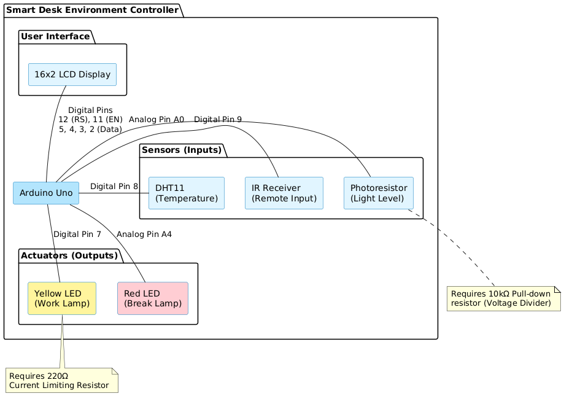
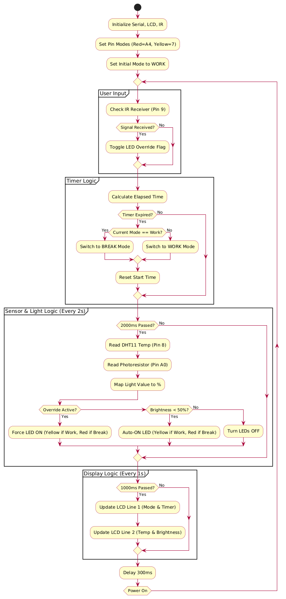

# Smart Desk Controller

## 📖 Project Overview
The **Smart Desk Environment Controller** is an autonomous embedded system designed to improve productivity and wellness for office workers and students. It monitors real-time desk conditions (temperature and lighting) and enforces healthy work/break cycles (Pomodoro timer) using a countdown timer and visual LED cues.

### Features
*   **Work/Break Timer:** Automatically switches modes every 30 minutes (accelerated to 30s for demo).
*   **Adaptive Lighting:** Monitors ambient light via a Photoresistor; automatically enables desk lamps when brightness falls below 50%.
*   **Environmental Monitoring:** Real-time Temperature (°C) and Brightness (%) display.
*   **Manual Override:** IR Remote integration to force desk lights ON/OFF regardless of sensor data.
*   **Visual Feedback:**
    *   **Yellow LED:** Active during Work Mode.
    *   **Red LED:** Active during Break Mode.

## ⚙️ Hardware Setup

### Components List
*   Arduino Uno R3
*   16x2 LCD Display
*   DHT11 Temperature Sensor
*   Photoresistor (LDR) + 10kΩ Resistor
*   IR Receiver (with Remote)
*   2x LEDs (Red, Yellow)
*   Resistors (220Ω for LEDs)

### Pin Mapping
| Component | Arduino Pin | Notes |
| :--- | :--- | :--- |
| **LCD RS** | 12 | |
| **LCD EN** | 11 | |
| **LCD D4-D7**| 5, 4, 3, 2 | |
| **DHT11** | 8 | Data Pin |
| **Photoresistor**| A0 | Analog Input |
| **Red LED** | A4 | Break Mode Indicator |
| **Yellow LED** | 7 | Work Mode Indicator |
| **IR Receiver**| 9 | PWM/Digital Input |

---

## 🚀 Installation & Setup

1.  **Install Libraries:**
    Open Arduino IDE and install the following libraries via the Library Manager:
    *   `LiquidCrystal` (Built-in)
    *   `DHT library` by Rob Tillart: https://github.com/RobTillaart/DHTlib 
    *   `IRremote` by Armani/Shirriff: https://github.com/Arduino-IRremote/Arduino-IRremote

2.  **Wiring:**
    Connect components according to the Pin Mapping table above.

3.  **Upload Code:**
    *   Open `SmardDesk.ino`.
    *   Select the correct Board (Arduino Uno) and Port.
    *   Click **Upload**.

---

## 🎮 How to Use

### Automatic Mode (Default)
1.  **Power On:** The system initializes in **Work Mode**.
2.  **Timer:** A countdown will run on the LCD.
    *   When the timer expires, the system toggles between **Work** and **Break**.
3.  **Lights:**
    *   Cover the Photoresistor (simulate darkness).
    *   If in **Work Mode**, the **Yellow LED** turns on.
    *   If in **Break Mode**, the **Red LED** turns on.
    *   Uncover the sensor, and lights turn off to save energy.

### Manual Interaction
*   **IR Remote:** Point the remote at the receiver and press the **Power/Toggle Button** (Hex code `0xBA45FF00` mapped).
*   **Action:** This overrides the light sensor and forces the active LED to stay ON, even in a bright room. Press again to return to Auto Mode.

---

## 🧠 System Logic

**State Machine:**
The system uses a non-blocking loop (using `millis()`) to handle three concurrent tasks:
1.  **Timer Task:** Updates countdown and switches modes.
2.  **Sensor Task:** Reads DHT11 and LDR every 2 seconds.
3.  **Display Task:** Refreshes LCD every 1 second.

---
